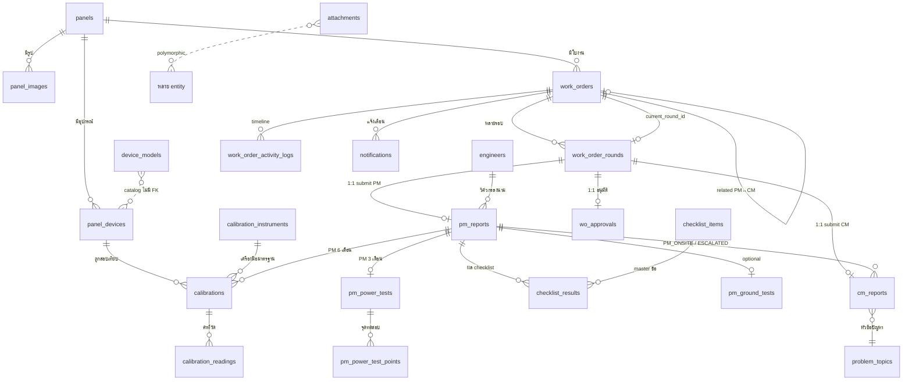

# RTU Database — ความสัมพันธ์ตารางและ Business Logic

> Schema: `rtu` · PostgreSQL ≥ 14 · Migrations `000001`–`000008` · ตารางทั้งหมด **22 ตาราง**  
> Canonical ER: [`rtu-full-schema.dbml`](./rtu-full-schema.dbml) · Data dictionary: [`rtu_db_dictionary.html`](./rtu_db_dictionary.html)

---

## 1. ภาพรวมสถาปัตยกรรม

ระบบนี้รองรับ 3 โดเมนหลักที่เชื่อมกัน:

| โดเมน | หน้าที่ | ตารางหลัก |
|-------|---------|-----------|
| **Core RTU** | ทะเบียนตู้ RTU, อุปกรณ์ที่ติดตั้ง, รูปภาพ, สถานะ | `panels`, `panel_devices`, `device_models`, `panel_images` |
| **Calibration** | สอบเทียบ/ทดสอบอุปกรณ์ (standalone หรือผูก PM 6 เดือน) | `calibration_instruments`, `calibrations`, `calibration_readings` |
| **PM/CM Workflow** | ใบงาน, รอบเข้าทำงาน, รายงาน, อนุมัติ, แจ้งเตือน | `work_orders`, `work_order_rounds`, `pm_reports`, `cm_reports`, … |

### หลักการออกแบบสำคัญ

- **PM และ CM อยู่ตารางเดียว** (`work_orders`) แยกด้วย `work_order_type`
- **1 ใบงาน = หลายรอบได้** (`work_order_rounds`) เมื่อ reject แล้วส่งงานใหม่
- **1 รอบ = 1 รายงาน + 1 การอนุมัติ** (1:1 กับ `pm_reports` / `cm_reports` / `wo_approvals`)
- **UUID ของคน** (`assigned_to`, `reviewer_id`, `actor_id`, …) **ไม่มี FK ไป users** — ระบบ auth อยู่ภายนอก (MWA)
- **`created_by` / `updated_by`** = audit ระบบ (ใครแก้ record) ไม่ใช่ business actor
- **Soft delete** = `active = false` (ยกเว้น `calibrations` / `calibration_readings` ลบจริง)

### Convention ทุกตาราง (ยกเว้น immutable log)

- `created_at`, `updated_at` — `NOT NULL DEFAULT now()`; `updated_at` ขยับด้วย trigger `rtu.set_updated_at()`
- `created_by`, `updated_by` — uuid ไม่มี FK (audit ระบบ)

---

## 2. แผนภาพความสัมพันธ์ (ER)



### ASCII overview (อ่านเร็ว)

```
panels ──< panel_devices    device_models (master catalog — ไม่มี FK)
   │              │
   │              ├──< calibrations >── calibration_instruments
   │              │         │
   │              │         └──< calibration_readings
   │              │
   │              └──< cm_reports (PM_ONSITE_FIX origin)
   │
   ├──< panel_images
   ├──< work_orders ──< work_order_rounds
   │         │                  │
   │         │                  ├──< pm_reports ──< checklist_results >── checklist_items
   │         │                  │         ├── pm_ground_tests
   │         │                  │         ├── pm_power_tests ──< pm_power_test_points
   │         │                  │         └── (calibrations ผ่าน pm_report_id / work_order_id)
   │         │                  │
   │         │                  ├──< cm_reports >── problem_topics
   │         │                  │         (STANDALONE / PM_ESCALATED)
   │         │                  └──< wo_approvals (1 ต่อ 1 ต่อ round)
   │         │
   │         ├──< work_order_activity_logs
   │         └──< notifications
   │
   └── engineers (อ้างอิงจาก pm_reports)

attachments — polymorphic (WORK_ORDER, PM_REPORT, CM_REPORT, CALIBRATION,
              PM_GROUND_TEST, PM_POWER_TEST_POINT, PANEL_DEVICE)
```

---

## 3. กลุ่มตารางและ Logic รายตาราง

### 3.1 Core RTU

#### `rtu.panels` — ทะเบียนตู้ RTU

| หัวข้อ | รายละเอียด |
|--------|------------|
| **หน้าที่** | ตู้ RTU 1 ตัว = 1 แถว (business key = `code` เช่น `RTU-011`) |
| **FK ออก** | ไม่มี (เป็นหัวโซ่) |
| **FK เข้า** | `panel_devices`, `panel_images`, `work_orders`, `pm_reports`, `cm_reports` |

**คอลัมน์สำคัญ**

| คอลัมน์ | Logic |
|---------|-------|
| `code` | รหัสตู้ (unique) — ใช้สร้าง `work_order_no` เช่น `PM-RTU-011-0001` |
| `latitude` / `longitude` | พิกัดตู้ (check-in ต้องอยู่ในรัศมี ~50m จากตู้) |
| `install_date` | วันที่ติดตั้งตู้ |
| `last_pm_date` / `next_pm_date` | **denormalized** — sync เมื่อ PM จบ `COMPLETED` หรือ `CONDITIONAL` |
| `active` | soft delete |

**Logic ที่ไม่มี column (API computed)**

- `operational_status` = aggregate จาก `panel_devices` ที่ active  
  Priority: `MONITORING` > `ABNORMAL` > `NORMAL`

---

#### `rtu.device_models` — Master catalog อุปกรณ์

| หัวข้อ | รายละเอียด |
|--------|------------|
| **หน้าที่** | รายการอุปกรณ์มาตรฐาน (code, ยี่ห้อ, รุ่น, …) สำหรับ prefill ฟอร์ม |
| **FK** | **ไม่มี FK ไป/จาก `panel_devices`** (decouple ตั้ง migration 000008) |

**Logic**

- แก้ master แล้ว **ไม่กระทบ** อุปกรณ์ที่ติดตั้งแล้วบนตู้
- UI ดึงค่าไป copy ลง `panel_devices` ตอนสร้าง/แก้

---

#### `rtu.panel_devices` — อุปกรณ์ที่ติดตั้งบนตู้

| หัวข้อ | รายละเอียด |
|--------|------------|
| **หน้าที่** | Snapshot อุปกรณ์จริงบนตู้ (ชื่อ, serial, tag, สถานะสื่อสาร/สุขภาพ) |
| **FK** | `panel_id` → `panels` (ON DELETE RESTRICT) |

**Constraint / Logic**

| กฎ | รายละเอียด |
|----|------------|
| `serial_number` | unique ทั้งระบบ |
| `(panel_id, tag_name)` | unique ต่อตู้ (partial index เมื่อ tag ไม่ null) |
| `communication_status` + `health_status` | คำนวณ `operational_status` ต่อ device: CRITICAL/OFFLINE → ABNORMAL; WARNING/DEGRADED/UNKNOWN → MONITORING; else NORMAL |
| การใช้งาน | CM (อุปกรณ์ที่มีปัญหา), checklist item 11 (Transmitters), calibration |

---

#### `rtu.panel_images` — รูปตู้ (S3)

| หัวข้อ | รายละเอียด |
|--------|------------|
| **หน้าที่** | เก็บ metadata รูป (`EXTERIOR`, `INTERIOR`, `DEVICE`) บน S3 |
| **FK** | `panel_id` → `panels` |

**Logic**

- ไม่ผูก `panel_device_id` — ยืดหยุ่นสูงสุด
- `file_size` 1–10 MB, `sort_order` เรียงแสดงผล
- API คืน presigned URL

---

### 3.2 Calibration

#### `rtu.calibration_instruments` — เครื่องมือมาตรฐาน

| หัวข้อ | รายละเอียด |
|--------|------------|
| **หน้าที่** | เครื่องที่นำมาสอบเทียบ (multimeter, pressure calibrator, …) |
| **FK เข้า** | `calibrations.instrument_id`, `pm_power_tests.instrument_id` |

**Logic (service layer)**

- ห้ามใช้ถ้า `active = false` หรือ `expire_date` หมดอายุ ณ วันทดสอบ
- `expire_date` ต้องหลัง `calibration_date`

---

#### `rtu.calibrations` — ใบสอบเทียบ

| หัวข้อ | รายละเอียด |
|--------|------------|
| **หน้าที่** | บันทึกการสอบเทียบ/ทดสอบอุปกรณ์ 1 ครั้ง |
| **FK** | `panel_device_id`, `instrument_id`; optional `work_order_id`, `pm_report_id` |

**2 โหมดใช้งาน**

| โหมด | `work_order_id` / `pm_report_id` | เงื่อนไข |
|------|----------------------------------|----------|
| **Standalone** | null | สอบเทียบนอก PM |
| **PM 6 เดือน** | มีค่า | ต้องผูก PM ที่ `pm_schedule_type = SIX_MONTH` เท่านั้น |

**Logic**

- `channel_type`: `PRESSURE`, `FLOW`, `LEVEL`, `RTU_READBACK`
- `result_type`: `TESTED`, `CALIBRATED_AND_TESTED`, `OTHER`
- Retry ไม่ผ่าน = **insert แถวใหม่** (เก็บ audit trail) ไม่ update แถวเดิม
- Submit PM 6 เดือนต้องมี calibration ≥ 1 ใบ
- EUT fields (`eut_manufacturer`, `eut_model`, …) = snapshot อุปกรณ์ ณ เวลานั้น

---

#### `rtu.calibration_readings` — ค่าที่วัดในใบสอบเทียบ

| หัวข้อ | รายละเอียด |
|--------|------------|
| **หน้าที่** | จุดทดสอบ 1–5 จุด ต่อใบ (`sequence` unique ต่อ calibration) |
| **FK** | `calibration_id` → `calibrations` (**ON DELETE CASCADE**) |

**Logic**

- `parameter_key` มาตรฐานตาม channel (เช่น `input_mmh2o`, `as_found_inc`, `current_flow_forward`, …)
- ลบใบสอบเทียบ → readings หายตาม

---

### 3.3 Master Data (ไม่ใช่ user login)

#### `rtu.engineers` — วิศวกรควบคุมงาน

| หัวข้อ | รายละเอียด |
|--------|------------|
| **หน้าที่** | ชื่อ/เลข กว. สำหรับพิมพ์บนรายงาน PM |
| **FK เข้า** | `pm_reports.engineer_id` |

ไม่มี workflow — เป็น master สำหรับเลือกบนรายงาน

---

#### `rtu.checklist_items` — รายการตรวจ PM (13 ข้อ)

| หัวข้อ | รายละเอียด |
|--------|------------|
| **หน้าที่** | Master checklist (`CL-01` … `CL-13`) |
| **FK เข้า** | `checklist_results.checklist_item_id` |

| คอลัมน์ | ค่า |
|---------|-----|
| `applicable_pm` | `PM3`, `PM6`, `BOTH` |
| `action_type` | `MAINTENANCE`, `MEASUREMENT`, `VISUAL_INSPECTION` |

---

#### `rtu.problem_topics` — หัวข้อปัญหา CM

| หัวข้อ | รายละเอียด |
|--------|------------|
| **หน้าที่** | Pill บน UI เลือกปัญหา (`COMM_LOST`, `POWER_FAILURE`, …) |
| **FK เข้า** | `cm_reports.problem_topic_id` |

**Logic**

- เมื่อ set `problem_topic_id` → service sync `tag_code` = `problem_topics.code`
- `tag_code` free text ยังรับได้ (legacy)
- Seed 12 รายการใน migration 000007

---

### 3.4 Work Order Core — หัวใจ workflow

#### `rtu.work_orders` — ใบงาน PM / CM

| หัวข้อ | รายละเอียด |
|--------|------------|
| **หน้าที่** | ใบงานหลัก — PM หรือ CM บนตู้ (และอาจชี้อุปกรณ์) |
| **FK** | `panel_id`, optional `panel_device_id`, `related_work_order_id`, `current_round_id` |

**คอลัมน์สำคัญ**

| คอลัมน์ | Logic |
|---------|-------|
| `work_order_no` | สร้างอัตโนมัติ: `{TYPE}-{panel.code}-{seq}` เช่น `PM-RTU-011-0001`; seq 10000+ ไม่ pad |
| `work_order_type` | `PM` หรือ `CM` |
| `pm_schedule_type` | **บังคับเมื่อ PM**: `THREE_MONTH` / `SIX_MONTH`; **ต้อง null เมื่อ CM** |
| `status` | lifecycle ใบงาน (ดู §4) |
| `priority` | `HIGH`, `MEDIUM`, `LOW` |
| `source` | `WORKFLOW`, `LEGACY_IMPORT` |
| `requested_by` | ผู้สร้างใบงาน (UUID) |
| `current_round_id` | ชี้รอบปัจจุบัน — **ไม่เก็บ `assigned_to` ซ้ำบนตารางนี้** |
| `related_work_order_id` | เชื่อม PM ↔ CM (escalate / spawn) |
| `planned_date` / `due_date` | วางแผน/กำหนดส่ง |
| `closed_at` | ปิดงาน |
| `active` | soft delete |

**Invariant**

- หลังสร้างเสร็จ ทุก work order ต้องมี ≥ 1 round
- ก่อนสร้าง CM ใหม่: ถ้ามี CM เปิดอยู่บนตู้เดียวกัน → **reuse** แทนสร้างใหม่

---

#### `rtu.work_order_rounds` — รอบเข้าทำงาน

| หัวข้อ | รายละเอียด |
|--------|------------|
| **หน้าที่** | 1 ครั้งที่มอบหมาย → check-in → check-out → submit |
| **FK** | `work_order_id` → `work_orders` (ON DELETE CASCADE) |

**คอลัมน์ WHO/WHEN**

| คอลัมน์ | ความหมาย |
|---------|----------|
| `round_no` | 1, 2, 3… เพิ่มเมื่อ reject แล้วเริ่มรอบใหม่ |
| `assigned_to` | ผู้รับผิดชอบรอบนี้ |
| `assigned_by` | ผู้มอบหมาย |
| `assigned_at` | เวลามอบหมาย |
| `check_in_at` + lat/lng | เริ่มงาน (mobile, ตรวจรัศมี ≤50m) |
| `check_out_at` + lat/lng | เสร็จงานหน้างาน |
| `submitted_at` | ส่งรายงาน → รออนุมัติ |

**Logic รอบ vs reassign**

| เหตุการณ์ | ผล |
|-----------|-----|
| **Reassign ก่อน check-in** | แก้ `assigned_to` รอบเดิม (ไม่เปิด round ใหม่) |
| **Reject หลัง submit** | เปิด `round_no + 1` บน work order เดิม |

**Unique:** `(work_order_id, round_no)`

---

#### `rtu.work_order_activity_logs` — Timeline (immutable)

| หัวข้อ | รายละเอียด |
|--------|------------|
| **หน้าที่** | Audit: ใครทำอะไร เมื่อไหร่ สถานะเปลี่ยนจาก→เป็น |
| **FK** | `work_order_id`, optional `work_order_round_id` |

**Action ตัวอย่าง**

`ASSIGNED`, `REASSIGNED`, `CHECKED_IN`, `CHECKED_OUT`, `SUBMITTED`, `STATUS_CHANGED`, `APPROVED`, `APPROVED_COND`, `REJECTED`, `CANCELLED`, `CM_SPAWNED`

- **ไม่มี `updated_at`** — log ไม่แก้
- Query timeline: `WHERE work_order_id = ? ORDER BY created_at`

---

#### `rtu.wo_approvals` — การอนุมัติ (1:1 ต่อ round)

| หัวข้อ | รายละเอียด |
|--------|------------|
| **หน้าที่** | Operator อนุมัติ/ปฏิเสธ/อนุมัติมีเงื่อนไข |
| **FK** | `work_order_id`, `work_order_round_id` (unique), optional `new_work_order_id` |

**Decision → สถานะ work order**

| `decision` | ผล |
|------------|-----|
| `APPROVED` | `COMPLETED` |
| `APPROVED_CONDITION` | `CONDITIONAL` |
| `REJECTED` | 2 เคส (ด้านล่าง) |

**REJECTED — 2 เคส**

| เคส | `new_work_order_id` | ผล |
|-----|---------------------|-----|
| **Rework (งานเดิม)** | NULL | เปิด round ใหม่บน PM/CM เดิม; assign คนเดิมหรือใหม่ |
| **Escalate เป็น CM** | CM work order (ใหม่/reuse) | กรอก `repair_date`; PM ไม่เปิด round ใหม่ → `CONDITIONAL`/`COMPLETED` |

PM/CM type ไม่ต้องเก็บในตารางนี้ — derive จาก `work_orders.work_order_type`

---

### 3.5 PM Report Domain

#### `rtu.pm_reports` — รายงาน PM (1:1 ต่อ round)

| หัวข้อ | รายละเอียด |
|--------|------------|
| **หน้าที่** | เอกสาร PM ที่ submit ในรอบนั้น |
| **FK** | `work_order_id`, `work_order_round_id` (unique), `panel_id`, `engineer_id` |

**สถานะ**

| สถานะ | ความหมาย |
|-------|----------|
| `DRAFT` | แก้ได้ (`PUT /work-orders/{id}/pm-report`) |
| `SUBMITTED` | ส่งแล้ว รอ approval |

**เนื้อหาตาม `pm_schedule_type`**

| ประเภท PM | ส่วนที่ต้องมี (ตอน submit) |
|-----------|---------------------------|
| `THREE_MONTH` | Checklist + Ground (optional) + **Power test** |
| `SIX_MONTH` | Checklist + Ground (optional) + **Calibration ≥ 1** |

1 work order อาจมีหลาย `pm_reports` ถ้ามีหลายรอบ (reject แล้วส่งใหม่)

---

#### `rtu.checklist_results` — ผลตรวจแต่ละข้อ

| หัวข้อ | รายละเอียด |
|--------|------------|
| **FK** | `pm_report_id`, `checklist_item_id`, optional `panel_device_id` |

**Logic ระดับข้อ**

| ประเภทข้อ | `panel_device_id` | จำนวนแถว |
|-----------|-------------------|----------|
| ข้อ 1–10, 13 (ระดับตู้) | NULL | 1 แถว/รายงาน |
| ข้อ 11 (Transmitters) | NOT NULL | 1 แถวต่ออุปกรณ์ |

**Unique:** `(pm_report_id, checklist_item_id, panel_device_id)` + partial unique index เมื่อ device null

---

#### `rtu.pm_ground_tests` — ทด Ground (optional)

| หัวข้อ | รายละเอียด |
|--------|------------|
| **FK** | `pm_report_id` (1:1 unique) |
| **Logic** | วัด resistance/voltage LG-NG, ผล `PASS`/`FAIL`; รองรับ OL → NULL+note |

ไม่ผูก PM Type ตายตัว — ใช้ได้ทั้ง PM3 และ PM6

---

#### `rtu.pm_power_tests` — Header ทด Power (PM 3 เดือน)

| หัวข้อ | รายละเอียด |
|--------|------------|
| **FK** | `pm_report_id` (1:1 unique), `instrument_id` → `calibration_instruments` |
| **Logic** | Submit PM 3 เดือน **บังคับ**; เครื่องมือต้องไม่หมดอายุ ณ วันทดสอบ |

---

#### `rtu.pm_power_test_points` — จุดทดสอบ Power

| หัวข้อ | รายละเอียด |
|--------|------------|
| **FK** | `pm_power_test_id` → `pm_power_tests` |
| **Logic** | 1 แถวต่อ `equipment_role`: `CIRCUIT_BREAKER`, `DC_POWER_SUPPLY` |

**Unique:** `(pm_power_test_id, equipment_role)`

---

### 3.6 CM Report Domain

#### `rtu.cm_reports` — รายงาน CM

| หัวข้อ | รายละเอียด |
|--------|------------|
| **หน้าที่** | บันทึกปัญหา/การแก้ไข |
| **FK** | `panel_id`, optional `panel_device_id`, `work_order_id`, `work_order_round_id`, `pm_report_id`, `problem_topic_id` |

**ไม่มี column `status` ของตัวเอง** — ถ้ามี `work_order_id` ดูที่ `work_orders.status`

**3 ต้นทาง (origin) — คำนวณจาก FK ไม่เก็บ column แยก**

| Origin | `work_order_id` | `pm_report_id` | ความหมาย |
|--------|-----------------|----------------|----------|
| **STANDALONE** | ✓ | — | Operator แจ้ง CM ตรง |
| **PM_ONSITE_FIX** | — | ✓ | ซ่อมหน้างานระหว่าง PM จบในตัว (ไม่เปิด WO ใหม่) |
| **PM_ESCALATED** | ✓ | ✓ | Report issue ระหว่าง PM → CM ใบงานแยก |

**CHECK:** ต้องมี `work_order_id` หรือ `pm_report_id` อย่างน้อย 1

**PM_ONSITE_FIX**

- ไม่มี work order ของตัวเอง
- สร้างเมื่อซ่อมสำเร็จแล้ว → ถือ **COMPLETED โดยนัย**
- ไม่ปรากฏใน `open_cm_work_orders` (filter จาก work order status)

**ฟิลด์เนื้อหาสำคัญ:** `problem_topic_id`, `problem_detail`, `root_cause`, `corrective_action`, `error_logs`, `pending_reason` (เมื่อ status=PENDING บน WO)

---

### 3.7 ไฟล์และการแจ้งเตือน

#### `rtu.attachments` — ไฟล์แนบ (polymorphic)

| หัวข้อ | รายละเอียด |
|--------|------------|
| **หน้าที่** | เก็บ metadata S3 ผูก entity ใดก็ได้ |
| **FK** | **ไม่มี FK บังคับ** — validate `entity_type` + `entity_id` ที่ service |

**`entity_type`:** `WORK_ORDER`, `PM_REPORT`, `CM_REPORT`, `CALIBRATION`, `PM_GROUND_TEST`, `PM_POWER_TEST_POINT`, `PANEL_DEVICE`

---

#### `rtu.notifications` — แจ้งเตือน (Screen 06)

| หัวข้อ | รายละเอียด |
|--------|------------|
| **FK** | `work_order_id` |
| **Type** | `NEW_ASSIGNMENT`, `PENDING_WORK`, `PENDING_APPROVAL`, `COMPLETED`, `CM_PENDING` |

**Logic**

- Emit จาก event workflow (assign, submit, approve, escalate)
- ผู้รับต่างกันตาม type (sub-contractor vs operator)

---

## 4. Lifecycle ใบงาน (Status Flow)

```
ASSIGNED
    │  POST /work-orders/{id}/check-in
    ▼
IN_PROGRESS
    │  POST /work-orders/{id}/check-out
    ▼
PENDING
    │  POST .../pm-report/submit หรือ .../cm-report/submit
    ▼
PENDING_APPROVAL
    │  POST /work-orders/{id}/approvals
    ├─ APPROVED ──────────────► COMPLETED
    ├─ APPROVED_CONDITION ────► CONDITIONAL
    └─ REJECTED ──────────────► PENDING (+ round ใหม่)
                                หรือ spawn CM + CONDITIONAL/COMPLETED
```

**PM เพิ่มเติม:** ระหว่าง `IN_PROGRESS` อาจ spawn CM

- **Report a Repair (onsite fix)** → `cm_reports` แบบ PM_ONSITE_FIX
- **Report an issue (escalate)** → CM work order แบบ PM_ESCALATED

---

## 5. PM Schedule Type — สิ่งที่ต้องทำต่อประเภท

| `pm_schedule_type` | Checklist | Ground test | Power test | Calibration |
|--------------------|-----------|-------------|------------|-------------|
| `THREE_MONTH` | ✓ | optional | **required** (submit) | — |
| `SIX_MONTH` | ✓ | optional | — | **≥1 ใบ** (submit) |

`calibrations` ผูก PM ได้ผ่าน `work_order_id` และ/หรือ `pm_report_id` (ต้องเป็น SIX_MONTH PM)

---

## 6. ตารางสรุป FK หลัก (อ่านเร็ว)

| จาก | ไป | ความสัมพันธ์ |
|-----|-----|--------------|
| `panel_devices` | `panels` | N:1 อุปกรณ์อยู่บนตู้ |
| `work_orders` | `panels` | N:1 ใบงานบนตู้ |
| `work_orders` | `panel_devices` | N:1 optional (CM มักชี้ device) |
| `work_orders` | `work_orders` | self — `related_work_order_id` (PM↔CM) |
| `work_order_rounds` | `work_orders` | N:1 หลายรอบต่อใบ |
| `work_orders` | `work_order_rounds` | `current_round_id` ชี้รอบปัจจุบัน |
| `pm_reports` | `work_order_rounds` | 1:1 ต่อรอบที่ submit |
| `cm_reports` | `work_order_rounds` | 1:1 (nullable ถ้า PM_ONSITE_FIX) |
| `wo_approvals` | `work_order_rounds` | 1:1 ต่อรอบที่ review |
| `checklist_results` | `pm_reports` + `checklist_items` | N:M ผ่าน junction |
| `checklist_results` | `panel_devices` | optional — ข้อ 11 |
| `calibrations` | `panel_devices` + `calibration_instruments` | ใบสอบเทียบ |
| `calibrations` | `work_orders` / `pm_reports` | optional — PM 6 เดือน |
| `cm_reports` | `pm_reports` | optional — จาก PM flow |
| `cm_reports` | `problem_topics` | หัวข้อปัญหา |
| `pm_power_tests` | `calibration_instruments` | เครื่องมือทด power |
| `notifications` | `work_orders` | แจ้งเตือนตามใบงาน |

---

## 7. สิ่งที่ควรจำเวลาอ่าน / query

| คำถาม | วิธีหา |
|-------|--------|
| ใครรับผิดชอบงานตอนนี้? | JOIN `work_orders.current_round_id` → `work_order_rounds.assigned_to` |
| ประวัติทั้งใบ? | `work_order_activity_logs` WHERE `work_order_id` ORDER BY `created_at` |
| รายงานของรอบปัจจุบัน? | `pm_reports` / `cm_reports` WHERE `work_order_round_id = current_round` |
| CM เปิดอยู่บนตู้? | `work_orders` WHERE `type=CM` AND `status IN (ASSIGNED, IN_PROGRESS, PENDING, PENDING_APPROVAL)` |
| PM 3 vs 6 เดือน? | `work_orders.pm_schedule_type` กำหนด power test vs calibration |
| Users อยู่ที่ไหน? | ไม่มีในฐานนี้ — เก็บแค่ UUID |

---

## 8. Business rules ที่บังคับในชั้น service

| กฎ | Error code (ตัวอย่าง) |
|----|----------------------|
| `performed_at` ล่วงหน้าเกิน 5 นาทีไม่ได้ | `E300_121` |
| สอบเทียบอุปกรณ์ที่ `active = false` ไม่ได้ | `E300_111` |
| ใช้เครื่องมือที่ปิดใช้งาน / ใบรับรองหมดอายุไม่ได้ | `E300_115`, `E300_116` |
| PM submit: power test บังคับ THREE_MONTH | `E300_236` |
| PM submit: calibration ≥1 บังคับ SIX_MONTH | `E300_237` |
| Calibration ผูก PM ได้เฉพาะ SIX_MONTH | `E300_240` |
| `pm_schedule_type` บังคับเมื่อ PM, ห้ามเมื่อ CM | `E300_205`, `E300_206` |
| Approval reject → rework เปิด round ใหม่; escalate → spawn/reuse CM | — |
| Panel `last_pm_date` / `next_pm_date` sync เมื่อ PM COMPLETED/CONDITIONAL | — |
| CM: `problem_topic_id` ต้องชี้ topic ที่ active | `E300_242`, `E300_244` |
| CM duplicate: ตู้ + หัวข้อเดียวกัน ขณะมีใบเปิด | `E300_246` |
| CM create: `problem_topic_id` บังคับ | `E300_247` |
| CM topic ห้ามส่งเมื่อ PM | `E300_248` |

---

## 9. รายชื่อตารางทั้งหมด (22)

| กลุ่ม | ตาราง | Migration |
|-------|--------|-----------|
| Core RTU | `panels` | 000001 |
| | `device_models` | 000001, 000008 |
| | `panel_devices` | 000001, 000008 |
| | `panel_images` | 000003 |
| Calibration | `calibration_instruments` | 000001, 000007 |
| | `calibrations` | 000001, 000006 |
| | `calibration_readings` | 000001 |
| PM/CM master | `engineers` | 000006 |
| | `checklist_items` | 000006 |
| | `problem_topics` | 000007 |
| Work order | `work_orders` | 000006 |
| | `work_order_rounds` | 000006 |
| | `work_order_activity_logs` | 000006 |
| | `wo_approvals` | 000006 |
| PM report | `pm_reports` | 000006 |
| | `checklist_results` | 000006 |
| | `pm_ground_tests` | 000006 |
| | `pm_power_tests` | 000006 |
| | `pm_power_test_points` | 000006 |
| CM report | `cm_reports` | 000006, 000007 |
| Files / notify | `attachments` | 000006 |
| | `notifications` | 000006 |

---

## 10. เอกสารอ้างอิงใน repo

| ไฟล์ | เนื้อหา |
|------|---------|
| [`rtu-full-schema.dbml`](./rtu-full-schema.dbml) | ER + note ทุกตาราง (paste ลง dbdiagram.io) |
| [`rtu_db_dictionary.html`](./rtu_db_dictionary.html) | Data dictionary — regenerate: `node scripts/generate_rtu_db_dictionary.mjs` |
| [`../README.md`](../README.md) §4–§5 | API endpoints + business rules |
| `migrations/000006_*.sql` | PM/CM domain หลัก |
| `migrations/000008_*.sql` | decouple `panel_devices` จาก `device_models` |
